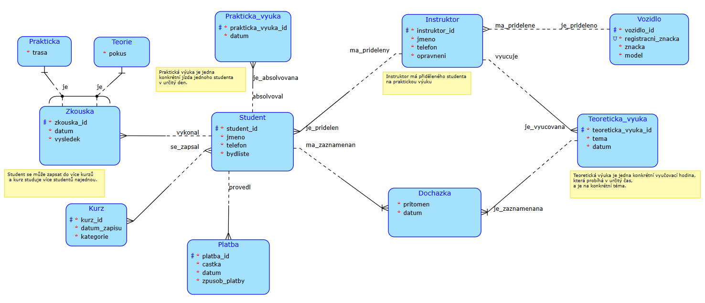
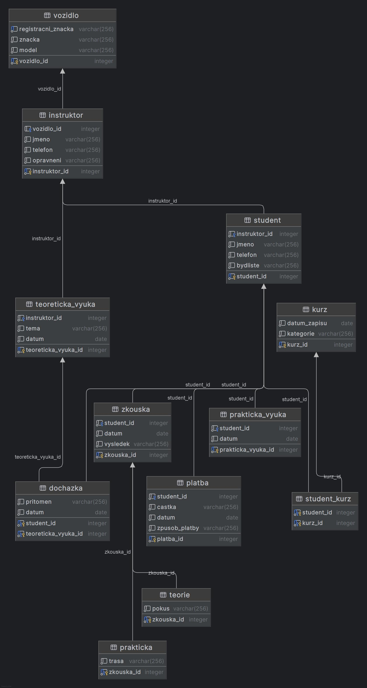

# Driving School Management Database
This project focuses on the architectural design and implementation of a relational database for a driving school. It covers student enrollment, instructor scheduling, vehicle maintenance, and exam results.

## Data Models
### Conceptual Model

### Relational Schema

- ## Technical Focus
- **Data Structure:** Design of 10+ tables with a focus on clean relationships.
- **Relational Logic:** Using Foreign Keys and cascading deletes to keep data consistent.
- **Automation:** A custom trigger to automatically handle the 3-attempt exam limit.
- **Practical Queries:** SQL scripts for checking attendance and instructor workload.

## Repository Structure
- `create.sql`: Database structure, constraints, and triggers.
- `queries.sql`: Practical examples of analytical queries.
- `insert.sql`: Sample dataset for testing the environment.
